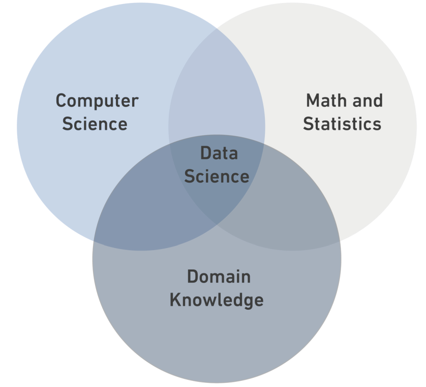

# Data Science

## What is Data Science?

**Data Science** is a _multidisciplinary field_ that combines statistics, computer science, and domain knowledge.



### Data Types:

* Structured Data
* Semi-Structured Data
* Unstructured Data

### Data Types Table

| Structured | Semi-Structured | Unstructured |
|-|-|-|
| It is data that has been organized into a strict schema. | It is data that does not conform to a schema but has some structure. | It is data that has no schema. |
| e.g: tables | e.g: xml | e.g: photos |

```python
print("DS Bootcamp")
```

[Read More](https://en.wikipedia.org/wiki/Data_science)